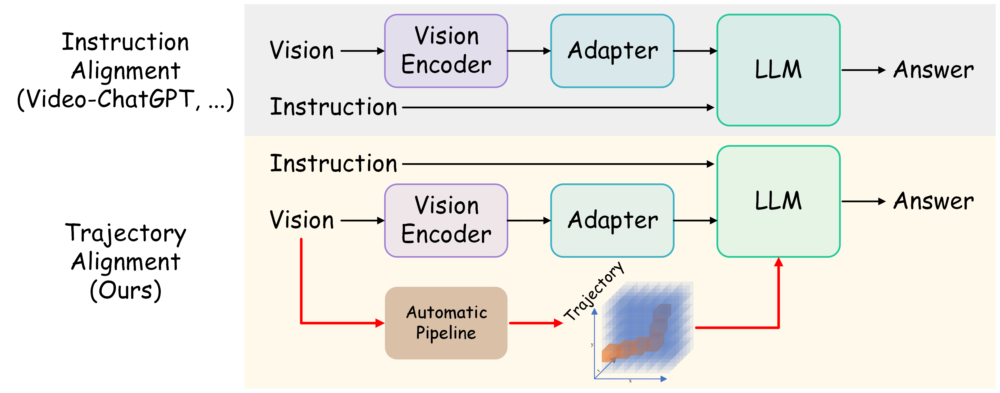

# 🎬 PiTe: Pixel-Temporal Alignment for Large Video-Language Model

[PiTe: Pixel-Temporal Alignment for Large Video-Language Model](https://arxiv.org/abs/2409.07239)

[Yang Liu*](https://yliu-cs.github.io), [Pengxiang Ding*](https://dingpx.github.io), [Siteng Huang](https://kyonhuang.top), Min Zhang, [Han Zhao](https://h-zhao1997.github.io), [Donglin Wang](https://milab.westlake.edu.cn)



Fueled by the Large Language Models (LLMs) wave, Large Visual-Language Models (LVLMs) have emerged as a pivotal advancement, bridging the gap between image and text. However, video making it challenging for LVLMs to perform adequately due to the complexity of the relationship between language and spatial-temporal data structure. Recent Large Video-Language Models (LVidLMs) align feature of static visual data like image into latent space of language feature, by general multi-modal tasks to leverage abilities of LLMs sufficiently. In this paper, we explore fine-grained alignment approach via object trajectory for different modalities across both spatial and temporal dimensions simultaneously. Thus, we propose a novel LVidLM by trajectory-guided Pixel-Temporal Alignment, dubbed PiTe, that exhibits promising applicable model property. To achieve fine-grained video-language alignment, we curate a multi-modal pre-training dataset PiTe-143k, the dataset provision of moving trajectories in pixel level for all individual objects, that appear and mention in the video and caption both, by our automatic annotation pipeline. Meanwhile, PiTe demonstrates astounding capabilities on myriad video-related multi-modal tasks through beat the state-of-the-art methods by a large margin.

## 🗄️ Dataset: PiTe-143k

The dataset PiTe-143k is available [here](https://yliu-cs.github.io/PiTe/).

## 🏠 Installation

```shell
git clone https://github.com/yliu-cs/PiTe.git
conda create -n PiTe python=3.11
conda activate PiTe
cd PiTe
pip install torch torchvision torchaudio
pip install -r requirements.txt
```

## 💎 Checkpoint

| Model    | URL                                                      | Password |
|----------|----------------------------------------------------------|----------|
| PiTe-7B  | [Download](https://pan.quark.cn/s/a4baeeca340f)(764.2MB) | uuK7     |
| PiTe-13B | [Download](https://pan.quark.cn/s/0135f7515d19)(1.19GB)  | vGqU     |

## ✴️ Inference

```shell
python inference.py --video_path "your_video_path" --query "your_question"
```

## ❤️ Acknowledgment

Thanks [PixelLLM](https://github.com/google-research/scenic/tree/main/scenic/projects/pixel_llm), [VTimeLLM](https://github.com/huangb23/VTimeLLM), [LLaVA](https://github.com/haotian-liu/LLaVA) for their excellent code implementations, which aided later study and are referenced in this implementation as available source code.

## 📜 Citation

Please cite our paper if you use PiTe in your work:

```bibtex
@inproceedings{conf/eccv/Liu24PiTe,
  author       = {Yang Liu and Pengxiang Ding and Siteng Huang and Min Zhang and Han Zhao and Donglin Wang},
  title        = {PiTe: Pixel-Temporal Alignment for Large Video-Language Model},
  booktitle    = {Proc. of ECCV},
  year         = {2024}
}
```